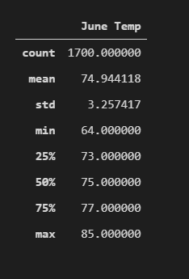
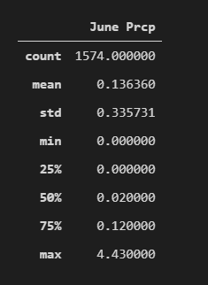
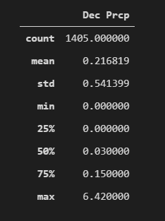

## **OVERVIEW OF THE PROJECT**
This project is about the weather pattern of an island in Hawaii. The backdrop of this analysis is to see whether a shop for ice cream and surfing products is feasible at this place? The data has been analyzed precisely for the months of **June** and **December** between the years of 2010 to 2017 to see the *Temperatures* and *Precipitation* levels.

## **RESULTS**

The *Temperature* pattern for the months of *June* and *December* can be analysed on the basis of three Statistical parameters of:
### **Mean**
### **Min (Minimum)**
### **Max (Maximum)**

Below are the snapshots of the Summary Statistics.

### **June & Dec Temperature data**

     

### **Mean**

The mean temperature for the months of *June* over the years is 74.94° F whereas the temperature for the months of *December* is 71.0° F.

### **Min**

The minimum temeprature for *June* is 64° F whereas that of *December* is 56° F.

### **Max**

The maximum temeprature for *June* is 85° F whereas that of *December* is 83° F.

## **SUMMARY**

The summary statistics tells us that there is a difference of 4° F in the mean temperature of these two months over the years whereas the difference in Minimum temp is 8°F and in Maximum temp the difference is only 2°F. All the higher numbers are for June.

 This comparison tells us that there is **no significant** difference in temepratures for these two months so to dig deeper, we have done a further analysis of **Precipitation (Prcp)** levels for the same months and below is the snapshot of the results.

### **June & Dec Prcp data**

         

In this analysis, we learned that average precipitation level in December is 0.21 whereas in June it is 0.14 which means the average precipitation in December is 54% higher than June. 

On the basis of the analysis of Temperatures and Precipitation levels in June and December, we feel more comfortable in making the correct decision of wether or not start the business there.
